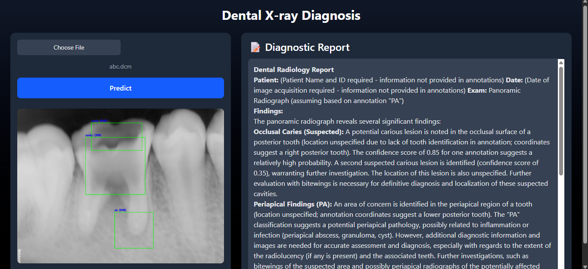

# 🦷 Dental X-ray Diagnosis Web App

A full-stack AI-powered web application that allows users to upload Dental X-ray DICOM images, detects pathologies using Roboflow’s object detection model and generates clinical diagnostic reports using Google's Gemini API.

This project demonstrates the power of combining medical imaging, deep learning and natural language generation using a modern full-stack architecture.

---

## 🌟 Features

- 📤 Upload `.dcm` or `.rvg` dental X-ray files
- 📸 Convert DICOM to PNG automatically
- 🤖 Detect cavities and periapical lesions using Roboflow
- 🧠 Generate diagnostic reports using Gemini LLM
- 🖼️ View annotated images with bounding boxes
- 💻 Responsive UI built with React + Tailwind CSS
- 🔐 Secure API key handling (never exposed to frontend)

---

## 🖼️ Demo



> *This demo shows dental X-ray, detecting pathologies and generating a real-time diagnostic report.*
[Demo Link](https://dental-x-ray-diagnosis-web-app.vercel.app/)
---

## 🧰 Tech Stack

| Layer     | Technology                      |
|-----------|----------------------------------|
| Frontend  | React.js, Tailwind CSS           |
| Backend   | FastAPI (Python), Uvicorn        |
| ML APIs   | Roboflow (Object Detection), Gemini (LLM) |
| Image Processing | pydicom, OpenCV, Pillow   |

---

## 🛠️ Usage Instructions

### 🔗 Prerequisites

- Python 3.8+
- Node.js (v16+)
- Git
- pip
- Virtualenv (recommended)
- Roboflow & Gemini API Keys

---

### 📁 1. Clone the Repository

```bash
git clone https://github.com/engr-dhruv/Dental-X-ray-Diagnosis-Web-App.git
cd Dental-X-ray-Diagnosis-Web-App
```

### 📁 2. Backend Setup (FastAPI)
```bash
cd backend
pip install -r requirements.txt
cp .env.example .env            # Create a .env file and add your API keys
```
▶️ Run the Backend
```bash
uvicorn main:app --reload
```

### 📁 3. Frontend Setup 
```bash
cd frontend
npm install
npm run dev
```
